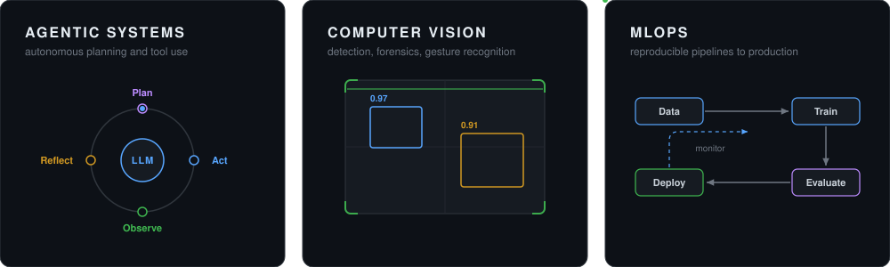

  

## About

I am an AI/ML engineer and a B.Tech student at Gati Shakti Vishwavidyalaya (GSV). I like taking machine learning ideas all the way from a notebook experiment to a working product that people can actually use.

Most of my work sits in three areas. I build agentic systems, where an LLM plans a task, calls tools and APIs, checks its own results, and keeps going until the job is done. I work on computer vision problems such as image forgery detection and gesture recognition. And I care about MLOps: clean data pipelines, reproducible training, honest evaluation, and deployment that doesn't fall over.

Right now I am exploring multi-agent architectures and rigorous LLM evaluation and benchmarking.

## Focus Areas

## Featured Projects

| Project | What it does | Tech |
|---------|--------------|------|
| [RAGvisor](https://github.com/TheharshVardhan01/RAGvisor) | Answers questions from PDFs and the web using Retrieval-Augmented Generation with Groq LLMs | Python, LangChain, Streamlit |
| [DeepDetect](https://github.com/TheharshVardhan01/DeepDetect) | A browser extension with an AI backend that detects tampered and fake images | JavaScript, Python, CV |
| [AI Krishidoot](https://github.com/TheharshVardhan01/AI_Krishidoot) | An agentic AI assistant built for the welfare of hyperlocal farmers | Python, LLM agents |
| [Gesture Media Control](https://github.com/TheharshVardhan01/Hand-Gesture-Controll-using-machine-leanrning-in-python-) | Play, pause, and change volume with hand gestures, no touch needed | Python, OpenCV |
| [AssetOpsBench](https://github.com/TheharshVardhan01/AssetOpsBench) | A benchmark for AI agents on Industry 4.0 asset operations | Python, agents |

## Tech Stack

**Languages**

**AI / ML**

**MLOps and Tools**

## Activity

---

I am open to collaborations on AI/ML projects and research. Feel free to reach out.

