<h3><code>harsh@github ~ $ ./contributions.sh</code></h3>

  

<h3><code>harsh@github ~ $ whoami</code></h3>

<table>
  <tr>
    <td valign="top"></td>
    <td valign="top"></td>
  </tr>
</table>

 

<h3><code>harsh@github ~ $ ls ~/projects</code></h3>

<table>
  <tr><th align="left">project</th><th align="left">what it does</th><th align="left">tech</th></tr>
  <tr><td><a href="https://github.com/TheharshVardhan01/RAGvisor">RAGvisor</a></td><td align="left">PDF & web Q&amp;A with Retrieval-Augmented Generation and Groq LLMs</td><td>Python · LangChain · Streamlit</td></tr>
  <tr><td><a href="https://github.com/TheharshVardhan01/DeepDetect">DeepDetect</a></td><td align="left">Browser extension + AI backend that detects tampered and fake images</td><td>JavaScript · Python · CV</td></tr>
  <tr><td><a href="https://github.com/TheharshVardhan01/AI_Krishidoot">AI Krishidoot</a></td><td align="left">Agentic AI assistant for the welfare of hyperlocal farmers</td><td>Python · LLM agents</td></tr>
  <tr><td><a href="https://github.com/TheharshVardhan01/italian-railway-directed-network-analysis">Railway Network Analysis</a></td><td align="left">Directed complex-network analysis of the Italian railway — 2.68M stop-level records</td><td>Python · NetworkX</td></tr>
  <tr><td><a href="https://github.com/TheharshVardhan01/Hand-Gesture-Controll-using-machine-leanrning-in-python-">Gesture Media Control</a></td><td align="left">Play, pause and change volume with hand gestures — no touch needed</td><td>Python · OpenCV</td></tr>
</table>

 

<h3><code>harsh@github ~ $ cat ~/.contact</code></h3>

 

Everything on this page is self-contained animated SVG, generated by <a href="./scripts">a handful of Python scripts</a> —
no JavaScript, no tokens, no third-party stats services. The contribution heatmap re-renders itself daily via
<a href=".github/workflows/update-profile-art.yml">GitHub Actions</a>.

